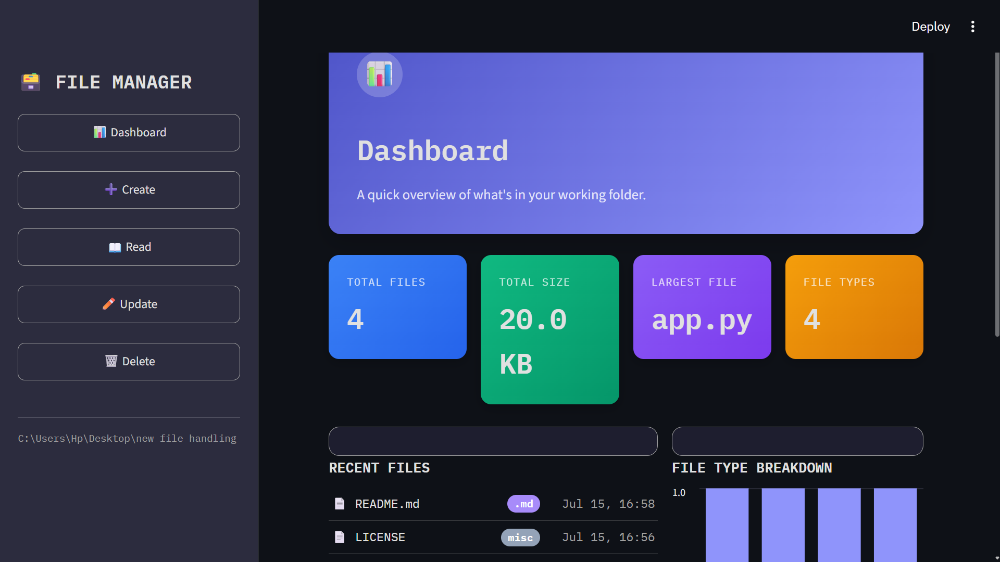
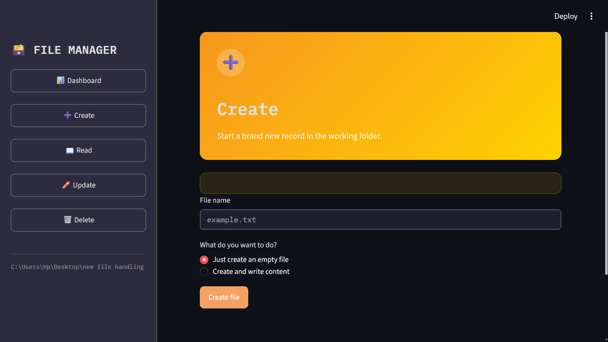
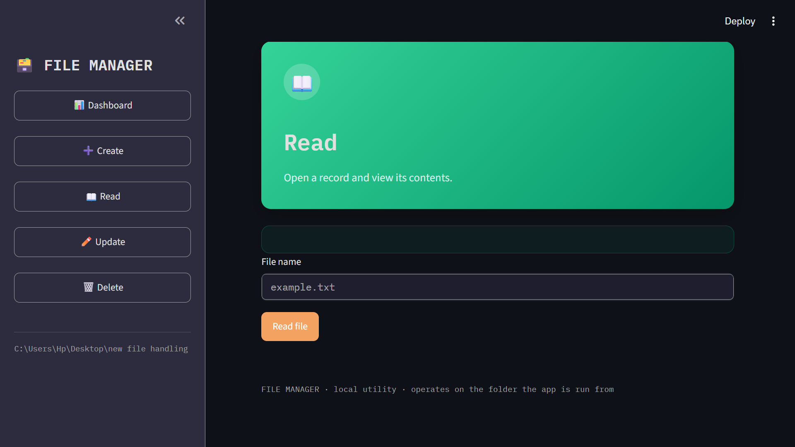
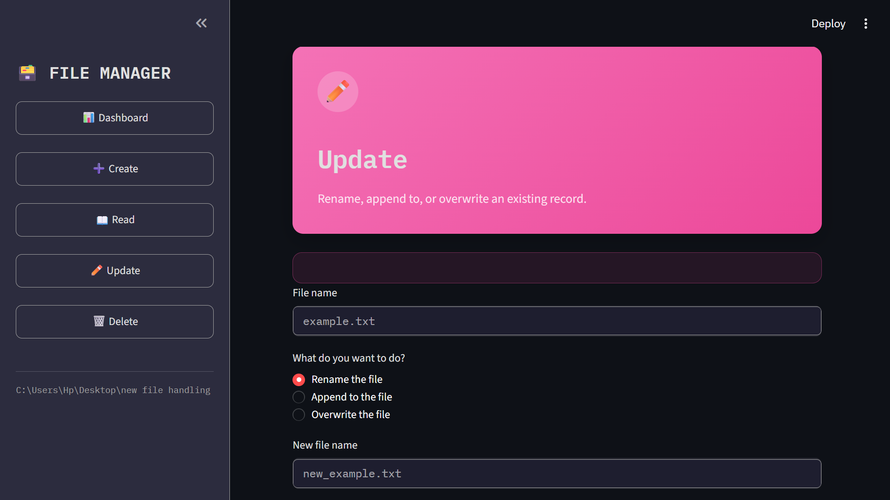
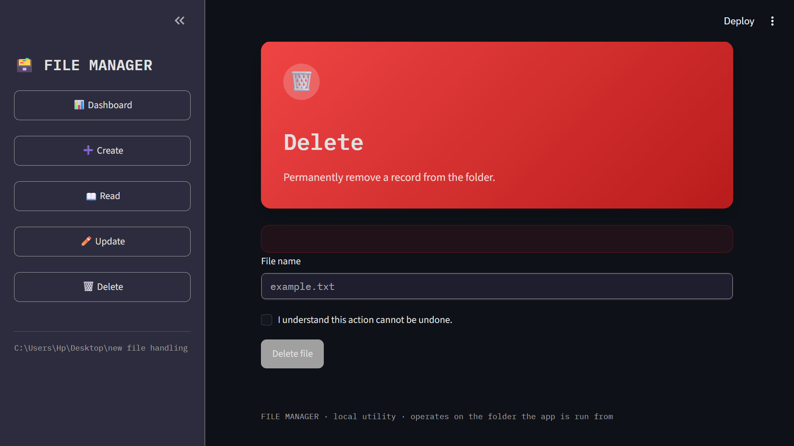

# 🗂️ File Manager Pro

> A modern **File Management System** built with **Python** and **Streamlit**, featuring an interactive dashboard and essential file handling operations through a clean and responsive user interface.


---

# ✨ Features

## 📊 Dashboard

- 📁 Total Files
- 💾 Total Storage Used
- 📄 Largest File Detection
- 📊 File Type Distribution
- 🕒 Recently Modified Files
- 📈 Interactive Charts

---

## 📄 File Operations

- ➕ Create Files
- 📖 Read Files
- ✏️ Rename Files
- 📝 Append Content
- 🔄 Overwrite Content
- 🗑️ Delete Files

---

## 🎨 Modern UI

- 🌙 Dark Theme
- 📱 Responsive Layout
- 🎯 Interactive Sidebar
- 🎨 Color-coded Dashboard
- 📊 Analytics Cards
- ⚡ Fast Navigation

---

# 📸 Application Screenshots

## Dashboard & Create

| Dashboard | Create File |
|-----------|-------------|
|  |  |

---

## Read & Update

| Read File | Update File |
|-----------|-------------|
|  |  |

---

## Delete

| Delete File |
|-------------|
|  |

---

# 🛠️ Tech Stack

| Technology | Purpose |
|------------|---------|
| Python | Programming Language |
| Streamlit | Web Application Framework |
| Pandas | Data Processing |
| Pathlib | File Management |
| HTML | UI Customization |
| CSS | Styling |

---

# 📂 Project Structure

```text
file-manager-pro/
│
├── app.py
├── requirements.txt
├── README.md
├── LICENSE
├── .gitignore
│
└── images/
    ├── dashboard.png
    ├── create.png
    ├── read.png
    ├── update.png
    └── delete.png
```

---

# 🚀 Installation

### Clone the repository

```bash
git clone https://github.com/tribhuwan-singh/file-manager-pro.git
```

### Navigate to the project

```bash
cd file-manager-pro
```

### Install dependencies

```bash
pip install -r requirements.txt
```

### Run the application

```bash
streamlit run app.py
```

---

# 💡 Key Concepts Demonstrated

- Python File Handling
- CRUD Operations
- Streamlit Development
- Dashboard Design
- Data Visualization
- Responsive UI Design
- Error Handling
- Project Structuring

---

# 📚 Learning Outcomes

This project helped me improve my understanding of:

- ✅ Python Programming
- ✅ File Handling
- ✅ Streamlit Framework
- ✅ Dashboard Development
- ✅ UI Design
- ✅ Error Handling
- ✅ Git & GitHub Workflow
- ✅ Building Portfolio Projects

---

# 🔮 Future Enhancements

- 🔍 File Search
- 📤 File Upload
- 📥 File Download
- 👁️ File Preview
- 📂 Workspace Support
- 🌗 Light/Dark Mode
- ☁️ Cloud Deployment

---

# 👨‍💻 Author

### Tribhuwan Singh Kunwar

**Aspiring Data Analyst | Python Developer**

- 🌐 GitHub: https://github.com/tribhuwan-singh
- 💼 LinkedIn: *(Add your LinkedIn profile URL here)*

---

# ⭐ Show Your Support

If you like this project, consider giving it a **⭐ Star** on GitHub.

It helps support my work and encourages future projects.

---

## 📄 License

This project is licensed under the **MIT License**.
